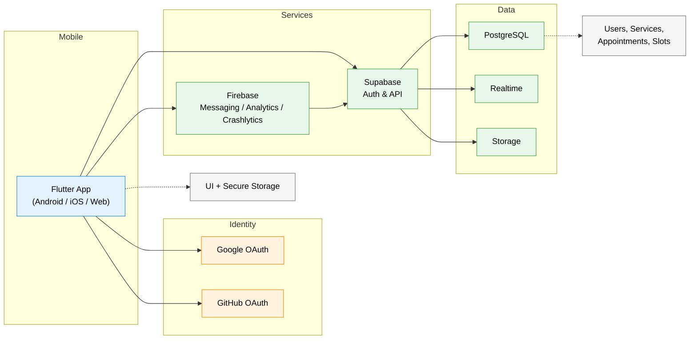

# DESARROLLO DE APLICACIONES PARA DISPOSITIVOS MÓVILES

## Diagrama de arquitectura (conexiones móviles → APIs → BD)

El siguiente diagrama muestra a alto nivel cómo se conecta la aplicación móvil con los servicios backend, proveedores de identidad y la base de datos.

## Explicación breve

- La app Flutter usa el SDK cliente de Supabase (`supabase_flutter`) para autenticación, llamadas a la API (REST/Realtime) y acceso a Storage.
- Para autenticación social la app puede usar OAuth nativo (GoogleSignIn / GitHub) o el flujo de OAuth via navegador; el resultado es un idToken que se envía a Supabase para crear/recuperar la sesión.
- Supabase expone endpoints REST y suscripciones Realtime (WebSockets) para sincronizar eventos en tiempo real (p. ej. actualizaciones de citas y slots).
- La base de datos principal es PostgreSQL (provisionada por Supabase). Los datos transaccionales (usuarios, citas, servicios) residen aquí.
- Archivos (fotos, assets) se almacenan en Storage (Supabase Storage o Firebase Storage según configuración).
- Firebase complementa con notificaciones push (FCM), analítica y crash reporting.
- Seguridad: las credenciales OAuth y las huellas SHA-1 deben configurarse en Google Cloud Console; las reglas de RLS (Row Level Security) y políticas en Supabase controlan el acceso a datos.

## Recomendaciones prácticas

- Mantener la URL del redirect (deeplink) y los client IDs documentados en la configuración del proyecto (`.env`) y en el panel de Supabase/Google.
- Versionar y proteger el keystore de release; registrar su SHA-1 en Google Cloud para que OAuth nativo funcione en producción.
- Documentar los endpoints RPC/funciones Postgres usados por la app y sus permisos (roles) en Supabase.

---

Documento añadido automáticamente por el equipo de desarrollo. Si quieres que incorpore más detalle (diagramas por componente, secuencia de login, o ejemplos de llamadas), dime qué sección ampliar.
